# Land-Value

Here some results obtained by the study of a dataset about Land value :

## France Landing 

France landing in 2020 :

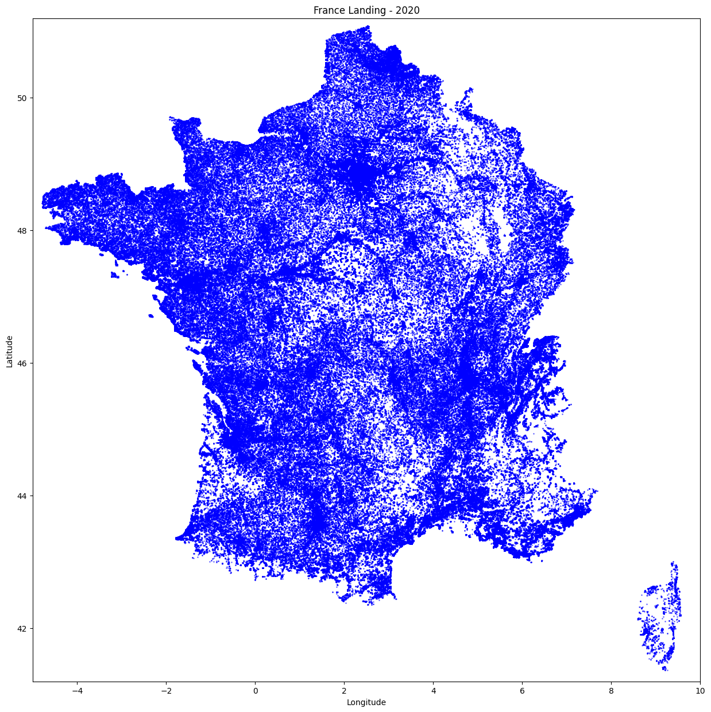

France landing in 2020 by number of rooms :

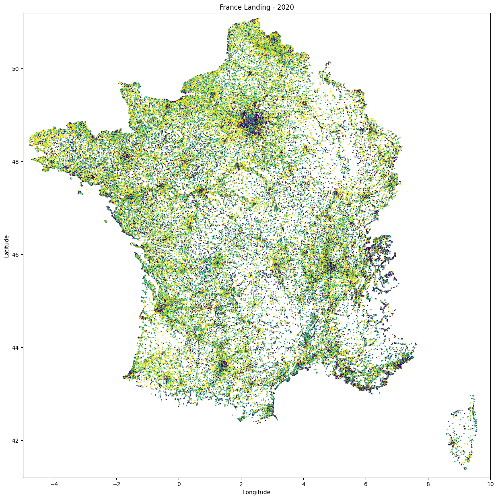

France landing in 2020 by property value :

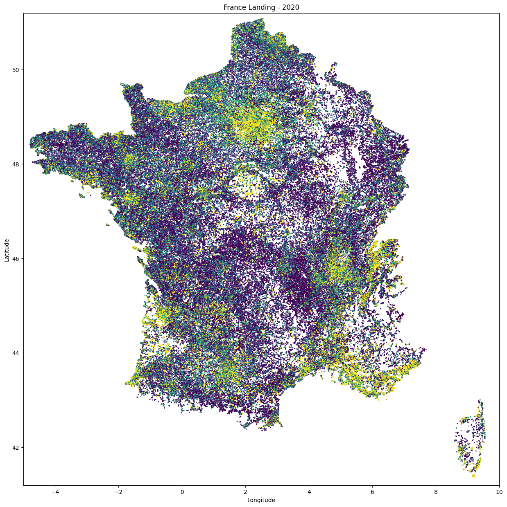

## Heatmaps

Global Heatmap of all variables :

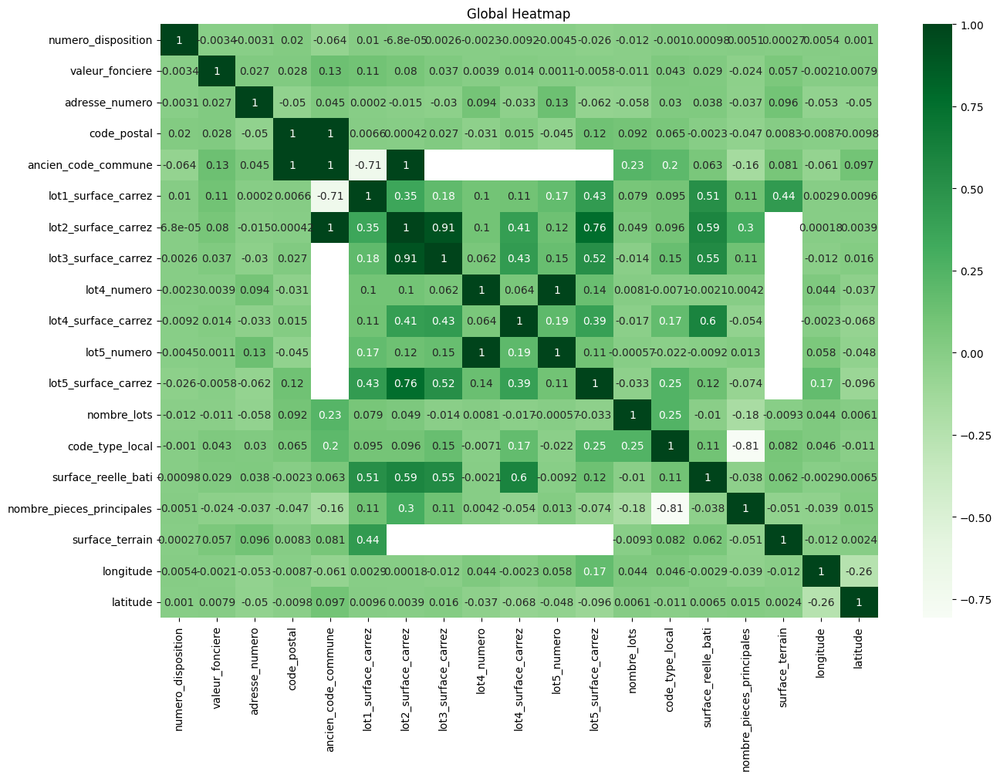

Average sales by day of the year :

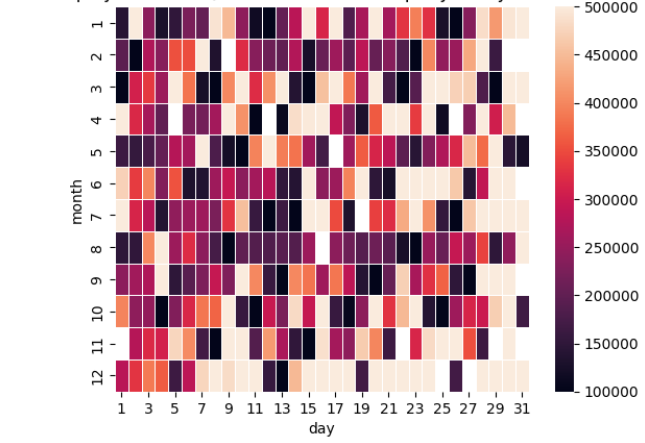

Average sales by week of the year :

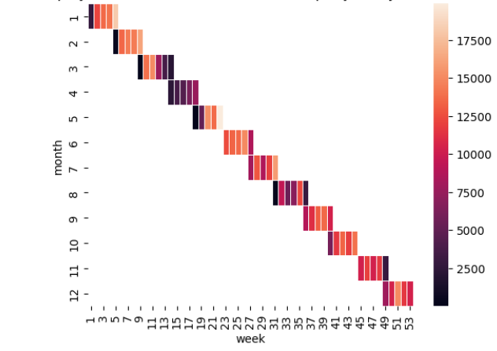

## Repartition

Property type repartition :

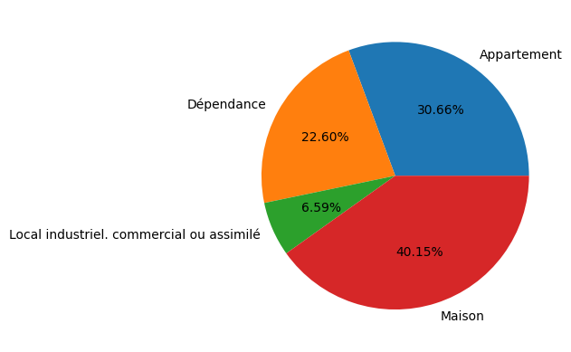

Sale type repartition :

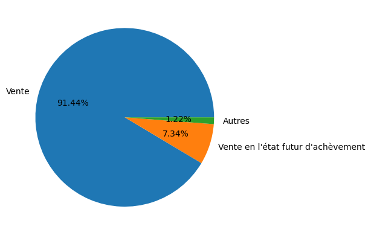

## Frequencies

Build area by Land Segmentation :

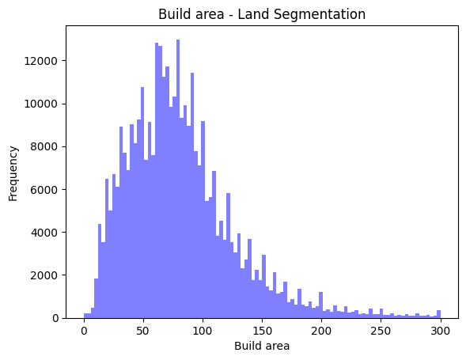

Plain area by Land Segmentation :

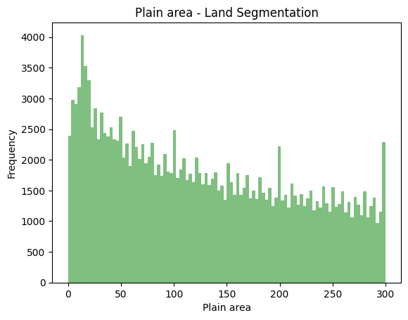

Frequencies of sale by day of the month

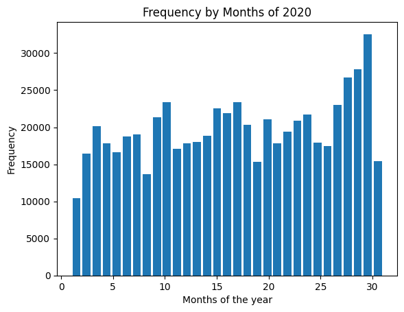

Average Price of Land Value sold by Month :

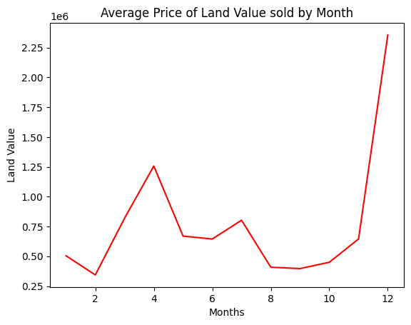
